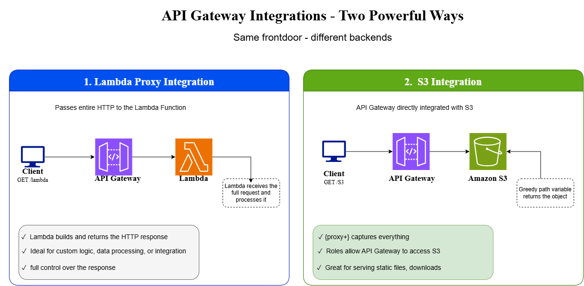

# Project 2 — Lambda + API Gateway Integration

*Hands-on runbook*

## Repo Contents

- `src/lambda_function.py` — the Lambda handler used behind `/lambda`
- `data/sample-data.json` — the object uploaded to S3 for `/s3/{proxy+}`
- `iam/S3ReadForApiGateway-policy.json` — the inline policy attached to the API Gateway → S3 execution role


## Flow of the exercise ..



## 1. What We Built

One REST API Gateway exposes two endpoints using two different integration patterns: `GET /lambda` uses Lambda Proxy Integration, while `ANY /s3/{proxy+}` integrates directly with S3 without Lambda in between.

```text
Client
  │
  ▼
API Gateway: aruna-lambda-apigw-api
├── GET /lambda ─────→ Lambda: aruna-lambda-apigw
│                       (Lambda Proxy Integration)
└── ANY /s3/{proxy+} → S3: aruna-lambda-apigw-bucket
                        (AWS Service Integration)
```

## 2. Resources Created

| Resource | Name | Purpose |
|---|---|---|
| S3 bucket | `aruna-lambda-apigw-bucket` | Stores `sample-data.json` |
| Lambda | `aruna-lambda-apigw` | Backend for `/lambda` |
| IAM role | `aruna-apigateway-s3-role` | Lets API Gateway read S3 objects |
| REST API | `aruna-lambda-apigw-api` | API entry point |
| Resource | `/lambda` | Lambda endpoint |
| Resource | `/s3/{proxy+}` | Greedy path for S3 objects |
| Stage | `prod` | Deployed API stage |

## 3. Create S3 Bucket

1. S3 → Create bucket.
2. Bucket name: `aruna-lambda-apigw-bucket`.
3. Region: `us-east-1`.
4. Leave other settings at defaults → Create bucket.

## 4. Upload sample-data.json

Create `sample-data.json`:

```json
{
  "message": "Hello from S3 via API Gateway!",
  "project": "Lambda + API Gateway Integration"
}
```

5. Open the bucket → Upload → Add files.
6. Select `sample-data.json` → Upload.
7. Verify the object is present.

## 5. Create Lambda Function

8. Lambda → Functions → Create function → Author from scratch.
9. Name: `aruna-lambda-apigw`.
10. Runtime: use a currently supported Python runtime shown by the console.
11. Create function.

Replace the default code and Deploy:

```python
import json

def lambda_handler(event, context):
    return {
        "statusCode": 200,
        "headers": {"Content-Type": "application/json"},
        "body": json.dumps({
            "message": "Hello from Lambda via API Gateway!",
            "path": event.get("path"),
            "method": event.get("httpMethod")
        })
    }
```

The JSON response makes it easy to verify that API Gateway reached Lambda and passed request information.

## 6. Create IAM Role for API Gateway → S3

12. IAM → Roles → Create role.
13. Trusted entity: AWS service → API Gateway.
14. Keep `AmazonAPIGatewayPushToCloudWatchLogs` on the role.
15. Leave Permissions boundary as *Create role without a permissions boundary*.
16. Create role: `aruna-apigateway-s3-role`.

Add an inline policy named `S3ReadForApiGateway`:

```json
{
  "Version": "2012-10-17",
  "Statement": [{
    "Effect": "Allow",
    "Action": "s3:GetObject",
    "Resource": "arn:aws:s3:::aruna-lambda-apigw-bucket/*"
  }]
}
```

Copy the role ARN; it is needed for the S3 integration.

## 7. Create REST API

17. API Gateway → Create API → REST API.
18. API name: `aruna-lambda-apigw-api`.
19. Endpoint type: Regional.
20. Create API.

## 8. Create /lambda → GET → Lambda Proxy

21. Select `/` → Create Resource → name: `lambda` → Create Resource.
22. Select `/lambda` → Create Method → `GET`.
23. Integration type: Lambda Function.
24. Enable Lambda Proxy Integration.
25. Lambda function: `aruna-lambda-apigw`.
26. Create method.

Lambda Proxy Integration passes the HTTP request to Lambda and lets Lambda control the response format (`statusCode`, `headers`, `body`).

## 9. Create /s3/{proxy+}

27. Select `/` → Create Resource → name: `s3` → Create Resource.
28. Select `/s3` → Create Resource.
29. Enable Proxy resource.
30. Resource name: `{proxy+}` → Create Resource.

`{proxy+}` is a greedy path variable. For example, `/s3/sample-data.json` captures `sample-data.json` as the proxy value.

## 10. Configure Direct S3 Integration

31. Select `/s3/{proxy+}` → `ANY` → Edit integration.
32. Integration type: AWS Service.
33. AWS Region: `us-east-1`.
34. AWS Service: Simple Storage Service (S3).
35. HTTP method: `GET`.
36. Action type: Use path override.
37. Path override: `aruna-lambda-apigw-bucket/{proxy}`.
38. Execution role: paste the ARN for `aruna-apigateway-s3-role`.
39. Save.

**Important:** there is no Lambda on this path. API Gateway transforms the request into the S3 GET request and calls S3 directly.

## 11. Configure Method Response

40. Select `/s3/{proxy+}` → `ANY` → Method response.
41. Create response → status code `200`.
42. Add headers: `Content-Type`, `Timestamp`, `Content-Length`.
43. Save.

## 12. Deploy API

44. Deploy API.
45. Stage: `[New Stage]`.
46. Stage name: `prod`.
47. Deploy.
48. Copy the Invoke URL: `https://<api-id>.execute-api.us-east-1.amazonaws.com/prod`

## 13. Test

| Endpoint | URL | Expected result |
|---|---|---|
| Lambda | `https://<invoke-url>/lambda` | JSON response from Lambda |
| S3 | `https://<invoke-url>/s3/sample-data.json` | Contents of `sample-data.json` |

## 14. Key Learning

API Gateway is not only a Lambda trigger. A single API can route different resources to different backend types.

| | /lambda | /s3/{proxy+} |
|---|---|---|
| Backend | Lambda | S3 |
| Integration | Lambda Proxy | AWS Service |
| Processing | Lambda code | API Gateway transforms request and calls S3 |
| Lambda involved? | Yes | No |

## 15. Interview Memory

> With Lambda Proxy Integration, API Gateway passes the HTTP request to Lambda and Lambda controls the response. With AWS Service Integration, API Gateway can call supported AWS services directly, avoiding a Lambda hop.

## 16. Cleanup

When the project is finished, remove resources created only for this lab: API Gateway API/stage, Lambda function, S3 bucket/object, and IAM role/policy. Empty the S3 bucket before deleting it. Verify nothing else depends on these resources.

## 17. Final Checklist

- [ ] S3 bucket created and `sample-data.json` uploaded.
- [ ] Lambda function created and deployed.
- [ ] API Gateway → S3 IAM role created with S3 object read permission.
- [ ] REST API created.
- [ ] `/lambda` → GET → Lambda Proxy configured.
- [ ] `/s3/{proxy+}` → ANY → direct S3 integration configured.
- [ ] Method response headers configured.
- [ ] API deployed to `prod`.
- [ ] `/lambda` returned Lambda JSON.
- [ ] `/s3/sample-data.json` returned the S3 object.
